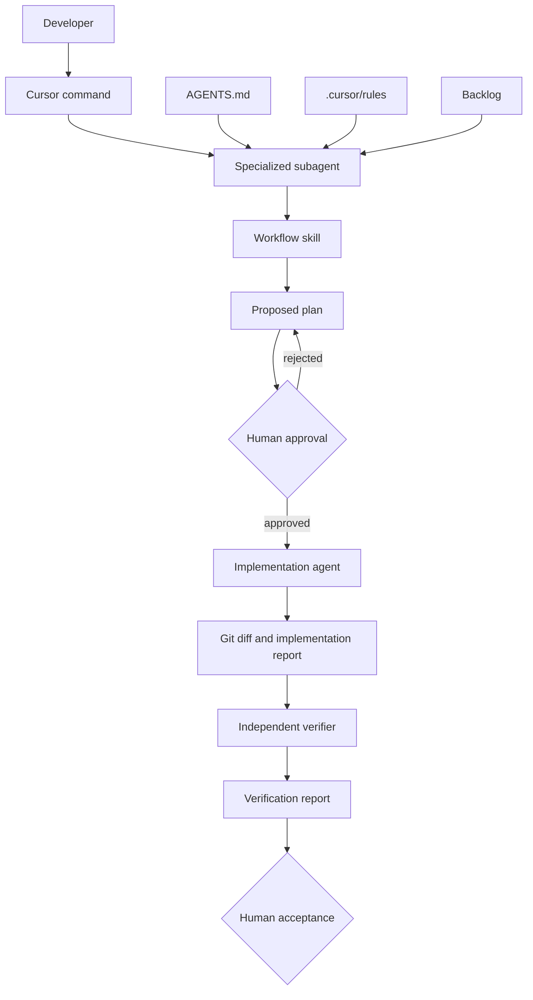

# 27. Cursor Agent Architecture

## 27.1. Мета

У репозиторії використовується багаторівнева конфігурація Cursor Agents. Її задача — зробити роботу агентів передбачуваною, доказовою та безпечною для архітектури starter kit.

Конфігурація розділяє:

- постійний контекст проєкту;
- архітектурні правила;
- повторювані процедури;
- ролі агентів;
- короткі команди запуску;
- backlog, плани та звіти;
- людський approval gate.

Агент не повинен одночасно безконтрольно планувати, реалізовувати та схвалювати власні зміни.

## 27.2. Архітектура агентної системи



Система має сім рівнів.

### Рівень 1 — Repository contract

`AGENTS.md` містить базову інформацію, яку повинен знати будь-який агент:

- призначення starter kit;
- entrypoints;
- архітектурні шари;
- dependency direction;
- package manager і команди;
- Definition of Done;
- заборонені destructive actions;
- обов’язковий workflow багфікса.

### Рівень 2 — Cursor rules

`.cursor/rules/*.mdc` містять короткі постійні або path-scoped правила.

Rules не описують довгий workflow. Вони блокують архітектурний drift під час будь-якої роботи:

- порушення Onion Architecture;
- приховані global dependencies;
- непереносимі infrastructure modules;
- непідтверджені заяви про успішну перевірку;
- небезпечні Git, Docker і database commands.

### Рівень 3 — Skills

`.cursor/skills/*/SKILL.md` описують повторювані процедури:

- повне рев’ю starter kit;
- планування одного багфікса;
- реалізація затвердженого плану;
- незалежна перевірка реалізації.

Skill визначає порядок роботи, потрібні джерела, guardrails, формат результату та місце збереження артефакту.

### Рівень 4 — Specialized agents

`.cursor/agents/*.md` задають вузькі ролі:

- architecture reviewer — тільки аналіз і звіт;
- bugfix planner — тільки дослідження та план;
- bugfix implementer — тільки реалізація approved plan;
- independent verifier — тільки перевірка без редагування коду.

Поділ ролей зменшує ризик, що один агент сам підтвердить власні припущення.

### Рівень 5 — Commands

`.cursor/commands/*.md` є короткими entrypoints для workflow.

Приклади:

```text
/review-starter
/plan-fix P0-01
/implement-fix P0-01
/verify-fix P0-01
```

Commands не дублюють повний skill. Вони лише вибирають роль, процедуру та вхідний артефакт.

### Рівень 6 — Work artifacts

```text
docs/agent-backlog/  -> підтверджені проблеми та стабільні ID
docs/agent-plans/    -> запропоновані або затверджені плани
docs/agent-reports/  -> review, implementation і verification evidence
```

Backlog описує проблему. Plan описує майбутню зміну. Report фіксує фактичну виконану роботу та результати команд.

### Рівень 7 — Human approval

Planner завжди створює plan зі статусом:

```yaml
status: proposed
```

Лише розробник вручну змінює його на:

```yaml
status: approved
```

Implementer не має права змінювати статус самостійно або працювати за незатвердженим планом.

## 27.3. Структура файлів і відповідальність

| Шлях | Відповідальність |
|---|---|
| `AGENTS.md` | Головний repository-wide контракт для всіх агентів. |
| `.cursorignore` | Виключає secrets, dependencies і generated output з індексації Cursor. |
| `.cursor/rules/00-project-context.mdc` | Базовий контекст starter kit і загальний режим роботи. |
| `.cursor/rules/10-onion-architecture.mdc` | Dependency direction і межі Domain/Application/Contracts/Infrastructure/Apps. |
| `.cursor/rules/20-module-portability.mdc` | Вимоги до typed registration та незалежності infrastructure modules. |
| `.cursor/rules/30-runtime-and-verification.mdc` | Мінімальні build/lint/test/bootstrap докази. |
| `.cursor/rules/40-agent-safety.mdc` | Заборонені destructive actions і правила роботи з secrets та Git. |
| `.cursor/skills/nestjs-starter-review/SKILL.md` | Повний evidence-based review workflow. |
| `.cursor/skills/bugfix-planning/SKILL.md` | Перевірка однієї проблеми та створення proposed plan. |
| `.cursor/skills/bugfix-implementation/SKILL.md` | Реалізація лише approved plan. |
| `.cursor/skills/change-verification/SKILL.md` | Незалежна перевірка diff і acceptance criteria. |
| `.cursor/agents/architecture-reviewer.md` | Read-only архітектурний reviewer. |
| `.cursor/agents/bugfix-planner.md` | Read-only planner однієї проблеми. |
| `.cursor/agents/bugfix-implementer.md` | Виконавець одного затвердженого плану. |
| `.cursor/agents/independent-verifier.md` | Read-only перевіряльник реалізації. |
| `.cursor/commands/review-starter.md` | Запуск повного review workflow. |
| `.cursor/commands/plan-fix.md` | Запуск planning workflow для одного issue ID. |
| `.cursor/commands/implement-fix.md` | Запуск implementation workflow для approved plan. |
| `.cursor/commands/verify-fix.md` | Запуск independent verification workflow. |
| `docs/agent-backlog/INDEX.md` | Стабільні ID проблем та відповідність секціям backlog. |
| `docs/agent-backlog/NESTJS_STARTER_KIT_REQUIRED_FIXES.md` | Повний source-of-truth перелік проблем і acceptance criteria. |
| `docs/agent-workflow/NESTJS_STARTER_KIT_REVIEW_PROMPT.md` | Детальний rubric повного архітектурного рев’ю. |
| `docs/agent-workflow/README.md` | Коротка інструкція для щоденної роботи з workflow. |
| `docs/agent-plans/README.md` | Формат планів і правила статусів. |
| `docs/agent-reports/README.md` | Формат і призначення звітів. |

## 27.4. Flow повного рев’ю

Запуск:

```text
/review-starter
```

Reviewer повинен:

1. прочитати `README.md`, `MODULES_OVERVIEW_NON_TECH.md`, `EXAMPLES.md` і review rubric;
2. перевірити package, TypeScript, Nest CLI, Docker, env, migrations і всі entrypoints;
3. побудувати внутрішню dependency map;
4. виконати доступні build/lint/test/bootstrap checks;
5. сформувати лише доказові findings;
6. не редагувати production code;
7. зберегти звіт у `docs/agent-reports/full-review-YYYY-MM-DD.md`.

## 27.5. Flow одного багфікса

### Крок 1 — вибрати проблему

Використовувати ID з:

```text
docs/agent-backlog/INDEX.md
```

Наприклад:

```text
P0-01
```

### Крок 2 — створити план

```text
/plan-fix P0-01
```

Planner:

- підтверджує, що проблема ще існує;
- знаходить усі affected contracts/providers/consumers;
- не змінює production code;
- створює `docs/agent-plans/P0-01-<slug>.md`;
- залишає `status: proposed`.

### Крок 3 — людський review плану

Розробник перевіряє:

- root cause;
- scope та out of scope;
- точні шляхи файлів;
- contract і DI changes;
- migration impact;
- acceptance criteria;
- verification commands.

Після схвалення розробник вручну змінює:

```yaml
status: proposed
```

на:

```yaml
status: approved
```

### Крок 4 — реалізувати

```text
/implement-fix P0-01
```

Implementer:

- перевіряє approved status;
- реалізує тільки scope плану;
- не додає інші backlog issues;
- виконує targeted checks після логічних фаз;
- виконує фінальні build/lint/test checks;
- створює implementation report.

### Крок 5 — незалежно перевірити

```text
/verify-fix P0-01
```

Verifier:

- читає source issue, approved plan і actual diff;
- перевіряє root cause;
- проходить кожен acceptance criterion;
- виконує команди самостійно;
- не редагує код;
- повертає `approved`, `changes-required` або `not-confirmed`.

### Крок 6 — людське приймання

Лише після verification report розробник приймає зміни або повертає їх на доопрацювання.

## 27.6. Verification matrix

| Зона зміни | Мінімальна перевірка |
|---|---|
| API controller/guard/DTO | `npm run build:api`, relevant tests, API bootstrap |
| Worker processor | `npm run build:worker`, relevant tests, Worker bootstrap |
| Cron schedule | `npm run build:cron`, relevant tests, Cron bootstrap |
| Migration code | `npm run build:migrations`, migration check on safe DB |
| Shared contract/token | `npm run build`, `npm run lint`, affected entrypoint bootstraps |
| Infrastructure module | `npm run build`, `npm run lint`, lifecycle and DI bootstrap |
| Domain/Application logic | `npm run build`, relevant unit tests |
| Docker configuration | Docker image build and Compose startup flow |

Недоступний Redis/PostgreSQL/SMTP/S3 потрібно фіксувати окремо від code defect.

## 27.7. Правила безпеки

Агенти не мають права без прямого дозволу:

- запускати production migrations;
- виконувати destructive SQL;
- видаляти Docker volumes;
- виконувати `docker compose down -v`;
- виконувати `git reset --hard` або force push;
- переписувати commits користувача;
- видаляти untracked files;
- змінювати реальні secrets у `.env`;
- маскувати помилки через `any`, `@ts-ignore` або вимкнення lint rules.

## 27.8. Як додати новий workflow

1. Створити skill:

```text
.cursor/skills/<workflow-name>/SKILL.md
```

2. Описати trigger, inputs, workflow, guardrails і output.
3. За потреби створити вузького subagent:

```text
.cursor/agents/<agent-name>.md
```

4. Створити коротку команду:

```text
.cursor/commands/<command-name>.md
```

5. Додати опис нового файлу в таблицю цього розділу.
6. Не додавати довгий workflow у `alwaysApply` rules.
